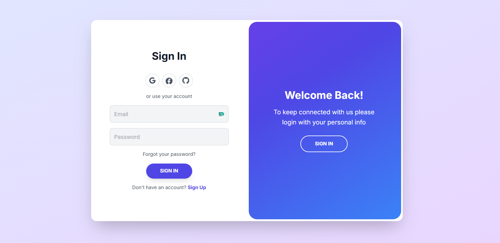

Modern Sliding Authentication Page

Small, single-file, fully responsive sign-in/sign-up experience with a smooth sliding overlay. Built with HTML, Tailwind CSS, and a tiny bit of vanilla JavaScript.

—

Preview



—

Features

- Smooth sliding overlay to switch between Sign In and Sign Up
- Single page (no reloads), state managed with one toggled CSS class
- Fully responsive layout (desktop and mobile)
- Tailwind CSS utility classes for quick customization
- Minimal JavaScript
- Social icons for Google, Facebook, and GitHub (UI only)

Tech Stack

- HTML5 for markup
- CSS3 (Tailwind + small custom CSS) for layout and animations
- Vanilla JavaScript for toggling the animation state

Quick Start

Clone the repository and open the page in your browser:

```
git clone https://github.com/vedantwankhade123/kodar.git
cd kodar
# Open index.html in your browser
```

Project Structure

- index.html — core markup and Tailwind hooks
- style.css — custom styles and animation rules
- script.js — event listeners and class toggling

How the Animation Works

The entire effect is controlled by one CSS class `.right-panel-active` on the main container (`#main-container`).

- Default: Sign In is visible; Sign Up is hidden underneath; overlay sits on the right
- Active: both forms translate on the X axis; the overlay slides left to reveal the opposite panel
- Transitions are handled with `transition: all 0.6s ease-in-out` on key containers

Notes

- The screenshot above is referenced at `assets/auth-preview.png`. Replace it with your own image if needed.
- Social buttons are decorative; wire them to providers if you integrate real auth.

Links

- Repository: https://github.com/vedantwankhade123/kodar